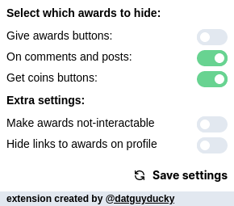

# 🎖️ No awards for Reddit

I'm sure I'm not the only one annoyed by the awards on Reddit. So I created this simple extension to completely hide them (on posts and comments), so if you would like to browse Reddit without them - **download** it from here:

-   [Firefox](https://addons.mozilla.org/en-US/firefox/addon/no-awards-for-reddit/)
-   [Google Chrome, Vivaldi, Opera, etc.](https://chrome.google.com/webstore/detail/no-awards-for-reddit/ehpnjdkpdllckhmbglbpdbmddcnloeep)

**TLDR:**

-   free and open-source
-   used daily by me, so if it stops working I will try to fix it ASAP
-   works on redesigned and old version of Reddit
-   disable awards on posts and comments
-   disable animated awards on comments
-   settings pop-up to customize which awards to show (for example: _show "Get awards" buttons but hide awards on posts and comments)
-   hide "Give Awards" on comments and posts **NEW**
-   hide "Coins X" on your profile dropdown **NEW**
-   option to show all awards but make them non-interactive **NEW**

## Settings pop-up:

## Hide awards on mobile

While I'm not available to make this work on mobile, there are a lot of **unofficial Reddit apps** for download and some of them have an option to hide awards, to name a few:

-   Rif is fun [Android](https://play.google.com/store/apps/details?id=com.andrewshu.android.reddit)
-   Sync [Android](https://play.google.com/store/apps/details?id=com.laurencedawson.reddit_sync)
-   Boost [Android](https://play.google.com/store/apps/details?id=com.rubenmayayo.reddit)
-   Slide [Android](https://play.google.com/store/apps/details?id=me.ccrama.redditslide) & [iOS](https://apps.apple.com/us/app/slide-for-reddit/id1260626828)
-   Relay [Android](https://play.google.com/store/apps/details?id=free.reddit.news)
-   Apollo [iOS](https://apps.apple.com/app/id979274575)
-   Comet [iOS](https://apps.apple.com/us/app/id1146204813)

**_I'm not a developer of any of these apps, use this list only as a suggestion to which app you can use. Not all of them may have an option to disable awards._**

## 📝 License

No awards for Reddit is an open-source project licensed under the [MIT License](https://github.com/datguysheepy/no-awards-fr/blob/master/LICENSE).
